# :tada: InternBook User Guide :books:
### Welcome to InternBook! :computer::books:
Hey there, future interns! Since you are here, we assumed that you are also a student, like us, who is starting your internship search.
Welcome to InternBook, your go-to companion in the exciting journey of applying for internships!

### Who Are We? :handshake:
We are a dynamic team of five students who have been in your shoes, feeling the struggle of juggling multiple internship
applications while trying to keep track of every detail. We get it - those Excel spreadsheets might seem like a good idea
at first, but let's face it, they quickly become a cluttered mess, making it harder to find what you need and leading to
inconsistencies in your data. That's why we decided to roll up our sleeves and create InternBook!

### What is InternBook?
InternBook isn't just another app - it's your personal assistant for managing internship applications effortlessly. With
InternBook, you can record crucial details like company names, application deadlines, contact emails, and the roles you
are applying for, all in one organised place. It is optimised for a _Command line Interface_ (CLI), but you can use the
advantages of a _Graphical User Interface_ (GUI). No more frantic searches through endless spreadsheets or sticky notes!

### Why Choose InternBook?
- **Simplicity:** Designed for students, whether you have a technical background or not. InternBook is easy to use and follow,
  ensuring a smooth experience for everyone. Say goodbye to complicated Excel templates. InternBook offers a clean and
  intuitive designed with your needs in mind.
- **Organisation:** Keep your internship applications neat and tidy. No more digging through clutter - everything you
  need is right at your fingertips.
- **Consistency:** Say hello to reliable data. With InternBook, there is error checking for inputs to ensure that the
  information is accurate, eliminating the headache of dealing with inconsistencies.

### What Can You Do with InternBook?
- **Record Applications:** Easily add new internship applications with all the important details with easy commands.
- **Track Progress:** Keep track of the status of each application, from not applied to applied.
- **Set Reminders:** Never miss a deadline again! Set reminders, and InternBook will make sure you stay on top of your game.

### Purpose of this User Guide
This user guide is tailored to introduce you to the core functionalities of InternBook, providing comprehensive examples
to kickstart your journey.

### How to use this user guide
Our user guide begins by providing guidance on [getting started](#getting-started). You can easily navigate effortlessly through our [features section](#features) for a detailed overview of all
available functionalities. Alternatively, utilise our convenient [Table of Contents](#table-of-contents) to quickly
access specific sections of interest. It provides the field constraints, including permitted values and compulsory
or optional parameters.

We have also included details about our [future enhancements](#future-enhancements), giving you a glimpse of what
features to anticipate.

Don't forget to check out our [frequently asked questions](#faq) section, where you'll find answers to common queries.
We understand that perfection takes time, so we appreciate your patience as we work to resolve any [known issues](#known-issues)
you may encounter.

For quick reference, consult our [command summary](#command-summary), which outlines key commands used throughout InternBook.

### User-centric statement of product information
**Product: InternBook**

**Product Description:**
InternBook is a user-friendly application designed to streamline the internship application process for students. It serves
as a comprehensive tool to organise, track, and manage internship applications effectively. Whether you are a tech-savvy
student or new to the internship search, InternBook simplifies the process, ensuring a smooth and efficient experience
for all users.

**Overview of Main Features:**

- **Application Recording:** Easily input and store details of internship applications, including company names,
  application deadlines, contact emails, and roles.
- **Progress Tracking:** Keep track of the status of each application, from not applied to applied, providing clarity
  and organisation throughout the application process.
- **Reminder Functionality:** Set reminders for upcoming application deadlines, ensuring timely submissions and proactive
  management of internship opportunities.
- **Sorting Options:**
  - **Alphabetical**: Arrange applications alphabetically by company name for easy reference and quick navigation.
  - **Start Date**: Sort applications based on the start date of the internship application, allowing users to prioritise
    applications based on upcoming opportunities.
  - **End Date**: Sort applications according to the end date of the internship application, facilitating planning and
    scheduling by highlighting approaching deadlines.
- **User-Friendly Interface:** With a clean and intuitive design, InternBook offers ease of navigation and accessibility,
  prioritising user experience and satisfaction.
- **Adaptability:** Suitable for students with or without technical backgrounds, InternBook caters to a diverse user base,
  providing a seamless experience for all.

So, whether you are just starting your internship search or you are a seasoned pro, InternBook is here to help you land
that dream internship. Let's turn those aspirations into achievements together!

Happy interning,  
The InternBook Team :rocket:

--------------------------------------------------------------------------------------------------------------------

## Table of Contents
* [Getting Started](#getting-started)
* [Features](#features)
  * [Help](#viewing-help-help)
  * [List](#listing-all-companies-list)
  * [Adding Company](#adding-a-company-add)
  * [Editing Company](#editing-a-company-edit)
  * [Locating Company and Tags](#locating-companies-and-tags-by-keywords-find)
  * [Deleting Company](#deleting-a-company-delete)
  * [Marking Company](#marking-a-company-mark)
  * [Unmarking Company](#unmarking-a-company-unmark)
  * [Sorting](#sorting-the-list-sort)
  * [Setting Reminders](#setting-reminders-reminder)
  * [Clearing All Entries](#clearing-all-entries-clear)
  * [Exiting Program](#exiting-the-program-exit)
  * [Saving Data](#saving-the-data)
  * [Editing Data File](#editing-the-data-file)
* [Future Enhancements](#future-enhancements)
* [Frequently Asked Questions](#faq)
* [Known Issues](#known-issues)
* [Command Summary](#command-summary)

--------------------------------------------------------------------------------------------------------------------

## Getting Started!

> **IMPORTANT**
> Ensure you have Java `11`  installed in your computer. If you do not have it installed, download it from [here.](https://www.oracle.com/sg/java/technologies/javase/jdk11-archive-downloads.html)
> Not sure if you have Java `11` downloaded, here's how to [check](#faq).
1. Download the latest `internBook.jar` from [here](https://github.com/AY2324S2-CS2103T-T13-2/tp/releases).
2. Copy the file to the folder you want to use as the _home folder_ for your InternBook.
>:bulb: **TIP**: Create a folder with internBook.jar so that the data files created will be stored in the same folder.
> Check our [FAQ](#faq) to see how to open it in your terminal.

3. Open a command terminal, `cd` into the folder you put the jar file in, and use the `java -jar internBook.jar` command to run the application.
> :bulb: **TIP**:
> If you are struggling to figure out the path to `cd` into, you can use the File Explorer in your OS to copy the file path and directly `cd` to that.  

> Alternatively, you can simply navigate to the file location the File Explorer and double-click on the application to run.

  A GUI similar to the one displayed below should appear in a few seconds. Note how the app already contains some sample data.  
     

4. Try out a command!  
   For instance, typing **`help`** and pressing Enter will open the help window. 
 You can also try out the following commands:

   * `list` : Lists all contacts.

   * `add -n Company -e company@gmail.com -t Role`: Adds a company contact with name ``Company``, email ``company@gmail.com`` and tag ``Role``.

   * `delete 1` : Deletes the contact with index ``1``.

   * `exit` : Exits the app.  

5. Refer to the [Features](#features) below for details of each command.

--------------------------------------------------------------------------------------------------------------------

## Features

<box type="info" seamless>

**Notes about the command format:** 

* Words in `UPPER_CASE` are the inputs to be supplied by the user. 
  e.g. in `add -n COMPANY`, `COMPANY` is the input which can be used as `add -n DBS`.

* Fields in square brackets are optional. 
  e.g `-n COMPANY [-p PHONE_NUMBER]` can be used as `-n DBS -p 61234567` or as `-n DBS`.

* Field with `…`​ after them can be used multiple times. 
  e.g. `-t TAG…​` can be used as `-t Software Engineer`, `-t Software Engineer -t Data Analyst` etc.

* Fields can be in any order. 
  e.g. if the command specifies `-n COMPANY -t Software Engineer`, `-t Software Engineer -n COMPANY` is also acceptable.

* Extraneous parameters for commands that do not take in inputs (such as `help`, `list`, `exit` and `clear`) will be ignored. 
  e.g. if the command specifies `help 123`, it will be interpreted as `help`.

* :exclamation: **Important:** Dates will only show in the GUI if both start date and end date are present. 

* If you are using a PDF version of this document, be careful when copying and pasting commands that span multiple lines as space characters surrounding line-breaks may be omitted when copied over to the application.
</box>

### Viewing help : `help`

Shows a pop-up window of our user guide for easier access.

Format: `help`

### Listing all companies : `list`

Shows a list of all companies in the InternBook.

Format: `list`

### Adding a company: `add`

Adds a company to the InternBook.

Format: `add -n COMPANY -e EMAIL -t TAG…​ [-p PHONE_NUMBER] [-d1 START_DATE] [-d2 END_DATE]`

| Field                      | Optional/Compulsory | Flag | Remarks                                                                                                                                                                                                                                                                                                                                                                                                                                                                                                                                                                                                                                                                                                                                                                                                        |
|----------------------------|---------------------|------|----------------------------------------------------------------------------------------------------------------------------------------------------------------------------------------------------------------------------------------------------------------------------------------------------------------------------------------------------------------------------------------------------------------------------------------------------------------------------------------------------------------------------------------------------------------------------------------------------------------------------------------------------------------------------------------------------------------------------------------------------------------------------------------------------------------|
| Company Name               | Compulsory          | -n   | Names should only have alphanumeric characters and spaces                                                                                                                                                                                                                                                                                                                                                                                                                                                                                                                                                                                                                                                                                                                                                      |
| Email                      | Compulsory          | -e   | Emails should be of the format local-part@domain and adhere to the following constraints: 1. The local-part should only contain alphanumeric characters and these special characters, excluding the parentheses, (+_.-). The local-part may not start or end with any special characters. The local-part may not have consecutive special characters. 2. This is followed by a '@' and then a domain name. The domain name is made up of domain labels separated by periods. The domain name must: - end with a domain label at least 2 characters long - have at least 2 domain labels separated by a dot (.) - have each domain label start and end with alphanumeric characters - have each domain label consist of alphanumeric characters, separated only by hyphens, if any. |
| Tag (Can be used as roles) | Compulsory          | -t   | Multiple tags are allowed Tags should only have alphanumeric characters and "/" Tags should not start or end with "/" Tags are case insensitive and the first alphabet of each word will be capitalised                                                                                                                                                                                                                                                                                                                                                                                                                                                                                                                                                                                            |                                                                                                                                                                                                                                                                                                                                                                                                                                                                                                                                                                                                                                                                                                          |
| Phone                      | Optional            | -p   | Phone numbers should be 3 or more digits                                                                                                                                                                                                                                                                                                                                                                                                                                                                                                                                                                                                                                                                                                                                                                       |
| Start Date                 | Optional            | -d1  | Dates should be in the form YYYY-MM-DD Start date must be earlier than or equals to end date                                                                                                                                                                                                                                                                                                                                                                                                                                                                                                                                                                                                                                                                                                               |
| End Date                   | Optional            | -d2  | Dates should be in the form YYYY-MM-DD End date must be later than or equal to start date                                                                                                                                                                                                                                                                                                                                                                                                                                                                                                                                                                                                                                                                                                                  |

Examples:
* `add -n DBS -t Software Engineer -e dbs@example.com -d1 2024-04-04 -d2 2024-05-05`
* `add -n Tiktok -t Data Analyst -e tiktok@example.com -p 61234567 -t AI Engineer`

:information_source: Remark:
* We allow the adding of duplicate companies with different start dates and end dates.
* This is fully intended and not a bug as this can allow users to keep track of different application windows of the same role in the same company.
* Check out our [FAQ](#faq) to understand how we distinguish duplicate entries.
* Start date can be added without the end date, and vice versa. However, when either dates are not entered, the record will
not show the dates. As shown below.

Here are the steps to add a company with examples of error messages and how to deal with them:
1. Input: `add -n Tik_Tok -p 91234-567 -e tiktokexample -t Soft-ware Engineer -d1 15-04-2024 -d2 2024-04-14` 
   * Error: Name cannot contain "_".
   
   * Correction: Remove "_".
2. Input: `add -n TikTok -p 91234-567 -e tiktokexample -t Soft-ware Engineer -d1 15-04-2024 -d2 2024-04-14` 
   * Error: Phone number should only contain numbers.
   
   * Correction: Remove non-numeric characters.
3. Input: `add -n TikTok -p 91234567 -e tiktokexample -t Soft-ware Engineer -d1 15-04-2024 -d2 2024-04-14` 
   * Error: Date format should be YYYY-MM-DD.
   * Correction: Adjust date format.
4. Input: `add -n TikTok -p 91234567 -e tiktokexample -t Soft-ware Engineer -d1 2024-04-15 -d2 2024-04-14` 
   * Error: Start date should precede end date.
   
   * Correction: Swap date order.
5. Input: `add -n TikTok -p 91234567 -e tiktokexample -t Soft-ware Engineer -d1 2024-04-14 -d2 2024-04-15` 
   * Error: Incorrect email format.
   
   For the complete error message, please consult the "Remarks" column in the [Adding a Company](#adding-a-company-add) table.
   * Correction: Adjust email format.
6. Input: `add -n TikTok -p 91234567 -e tiktok@example.com -t Soft-ware Engineer -d1 2024-04-14 -d2 2024-04-15` 
   * Error: Incorrect tag format.
   
   * Correction: Remove non-alphanumeric characters, except "/". However, it should not begin or end with "/". We apologise
   for the confusing error message and have reported it under [known issues](#known-issues).
7. Success: Company added successfully.  
   

### Editing a company : `edit`

Edits an existing company in the InternBook.

Format: `edit INDEX [-n NAME] [-p PHONE_NUMBER] [-e EMAIL] [-t TAG…]​ [-d1 START_DATE] [-d2 END_DATE]`

* Edits the company at the specified `INDEX`. The index refers to the index number shown in the displayed intern book. The index **must be a positive integer** 1, 2, 3, …​
* At least one of the optional fields must be provided.
* Only the fields provided will be updated i.e fields not provided will retain their original value.
* When editing tags, the existing tags of the company will be removed i.e adding of tags is not cumulative.

| Field                      | Optional/Compulsory | Flag | Remarks                                                                                                                                                                                                                                                                                                                                                                                                                                                                                                                                                                                                                                                                                                                                                                                                        |
|----------------------------|---------------------|------|----------------------------------------------------------------------------------------------------------------------------------------------------------------------------------------------------------------------------------------------------------------------------------------------------------------------------------------------------------------------------------------------------------------------------------------------------------------------------------------------------------------------------------------------------------------------------------------------------------------------------------------------------------------------------------------------------------------------------------------------------------------------------------------------------------------|
| Company Name               | Optional            | -n   | Names should only have alphanumeric characters and spaces                                                                                                                                                                                                                                                                                                                                                                                                                                                                                                                                                                                                                                                                                                                                                      |
| Email                      | Optional            | -e   | Emails should be of the format local-part@domain and adhere to the following constraints: 1. The local-part should only contain alphanumeric characters and these special characters, excluding the parentheses, (+_.-). The local-part may not start or end with any special characters. The local-part may not have consecutive special characters. 2. This is followed by a '@' and then a domain name. The domain name is made up of domain labels separated by periods. The domain name must: - end with a domain label at least 2 characters long - have at least 2 domain labels separated by a dot (.) - have each domain label start and end with alphanumeric characters - have each domain label consist of alphanumeric characters, separated only by hyphens, if any. |
| Tag (Can be used as roles) | Optional            | -t   | Multiple tags are allowed Tags should only have alphanumeric characters and "/" Tags should not start or end with "/"b                                                                                                                                                                                                                                                                                                                                                                                                                                                                                                                                                                                                                                                                                 |                                                                                                                                                                                                                                                                                                                                                                                                                                                                                                                                                                                                                                                                                                          |
| Phone                      | Optional            | -p   | Phone numbers should be 3 or more digits                                                                                                                                                                                                                                                                                                                                                                                                                                                                                                                                                                                                                                                                                                                                                                       |
| Start Date                 | Optional            | -d1  | Dates should be in the form YYYY-MM-DD Start date must be earlier than or equal to end date                                                                                                                                                                                                                                                                                                                                                                                                                                                                                                                                                                                                                                                                                                                |
| End Date                   | Optional            | -d2  | Dates should be in the form YYYY-MM-DD End date must be later than or equal to start date                                                                                                                                                                                                                                                                                                                                                                                                                                                                                                                                                                                                                                                                                                                  |
Examples:
*  `edit 1 -p 91234567 -e dbs_hr@example.com` Edits the phone number and email address of the 1st company in the currently displayed list to be `91234567` and `dbs_hr@example.com` respectively.
*  `edit 2 -n Meta -t Engineer` Edits the name of the 2nd company to be `Meta` and change the tags to `Engineer` only.

Here are the steps to edit the fields of a company:
1. Input: `edit 1 -n Amazon`
   * **Before:**
   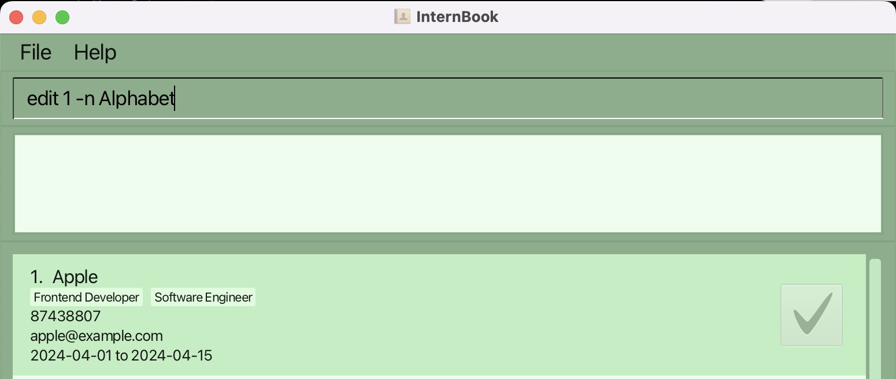
   *  **After:**
   
2. Input: `edit 1 -e alphabet@example.com`
   * **Before:**
   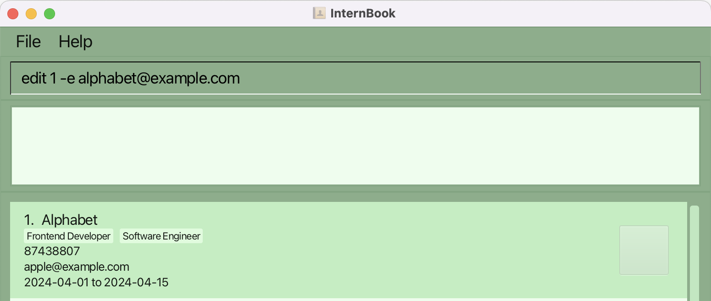
   * **After:**
   
3. Input: `edit 1 -t UI/UX Designer`
   * **Before:**
   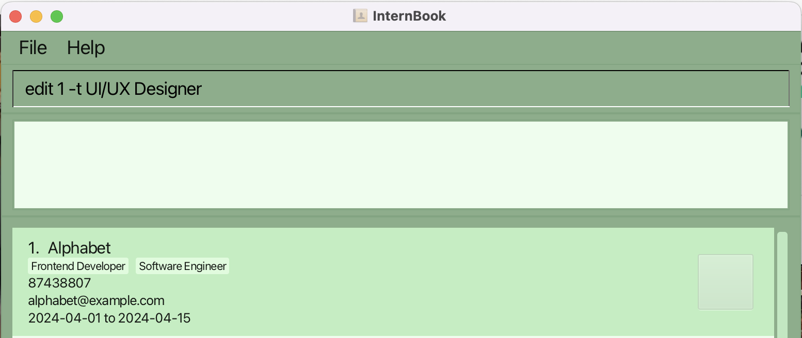
   * **After:**
   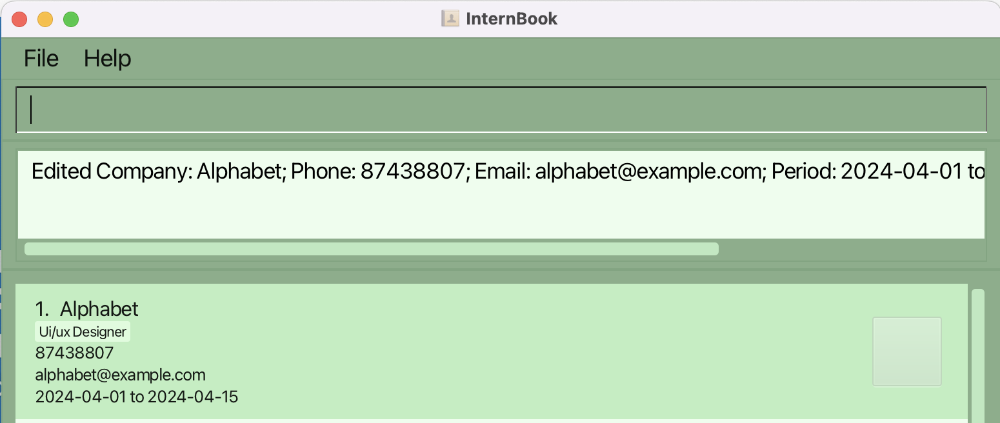
4. Input: `edit 1 -p 91234567`
    * **Before:**
      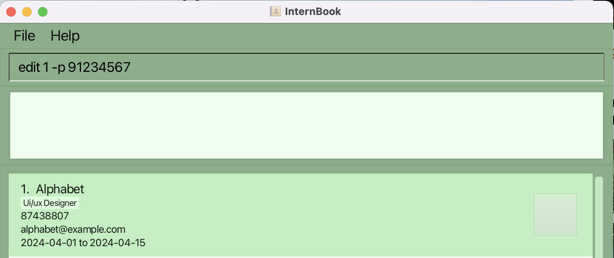
    * **After:**
      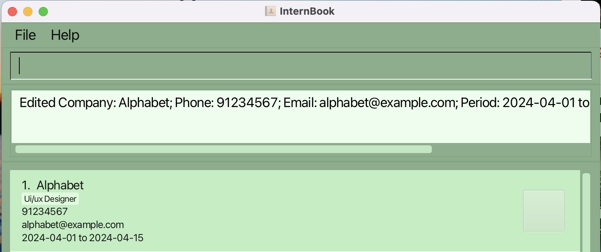
5. Input: `edit 1 -d1 2024-04-15 -d2 2024-05-01`
    * **Before:**
      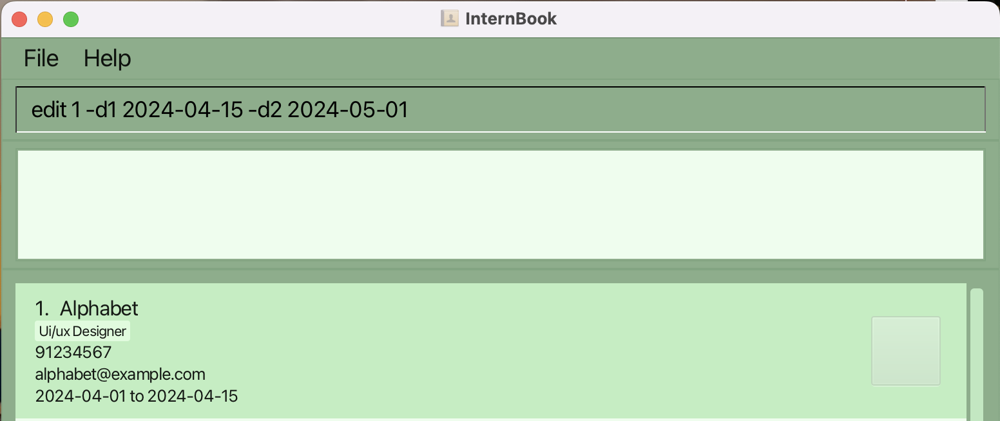
    * **After:**
      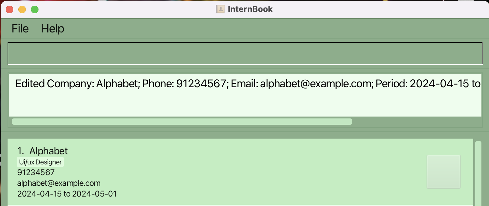

>:bulb: **TIP**:
> When editing the dates of an application, it is recommended to edit both start and end dates. 
> If only one of the date is edited, and the record is not showing anything, please refer to our [FAQ](#faq).

### Locating companies and tags by keywords: `find`

Finds companies whose names or tags begin with the given keyword.

Format: `find KEYWORD`

* The search is case-insensitive. e.g `Google` will match `google`
* The order of the keyword matters. e.g. `Software Engineer` will not match `Engineer Software`
* Only the name and tags are searched.
* The result screen will display all the **tags and names** that match the keyword.
e.g. `Software` will return a Company with name `Software XYZ` as well as a Company with tag `Software Engineer`.
* Only Companies/Tags or its words **beginning with** the keyword will be returned.
    e.g. `Test` will return `Test Engineer` or `QA Tester`, but not `QATester`.
* If there is a space in the keyword, it searches for a substring that matches with the whole word
e.g. `Software Engineer` will return `Software Engineering` but not `Software Developer` or `Staff Engineer`.

Examples:
* `find Google` returns `google` and `Google`
* `find software` returns `Software Company` and companies with tags matching `software`  

### Deleting a company : `delete`

Deletes the specified company from the InternBook.

Format: `delete INDEX`

* Deletes the company at the specified `INDEX`.
* The index refers to the index number shown in the currently displayed intern book.
* The index **must be a positive integer** 1, 2, 3, …​
* Error messages will be displayed when:
  * The index **is out of bounds**.

Examples:
* `delete 2` deletes the 2nd company in the intern book.
* `find Google` followed by `delete 1` deletes the 1st company in the results of the `find` command.

>:bulb:**TIP**:
> If you know what company you want to delete, you should search for it by using `find COMPANY`, followed by `delete INDEX`
> instead of going through all entries to look for the company.

### Marking a company : `mark`

Marks the specified company as applied.

Format: `mark INDEX`

* Marks the company at the specified `INDEX` as applied.
* The index refers to the index number shown in the currently displayed intern book.
* The index **must be a positive integer** 1, 2, 3, …​
* Error messages will be displayed when:
  * The company at the specified `INDEX` is already marked.
  * The index **is out of bounds**.

Examples:
* `mark 2` marks the 2nd company in the listed intern book if it is unmarked.
* `find Google` followed by `mark 1` marks the 1st company in the results of the `find` command, if it is unmarked.

> :bulb: **TIP**:
> After applying to a company, you should `find COMPANY` then `mark INDEX` instead of going through all entries to look
> for the company.

### Unmarking a company : `unmark`

Marks the specified company as not applied.

Format: `unmark INDEX`

* Marks the company at the specified `INDEX` as not applied.
* The index refers to the index number shown in the currently displayed intern book.
* The index **must be a positive integer** 1, 2, 3, …​
* Error messages will be displayed when:
  * The company at the specified `INDEX`  is already unmarked.
  * The index **is out of bounds**.

Examples:
* `unmark 2` unmarks the 2nd company in the listed intern book if it is marked.
* `find Google` followed by `unmark 1` unmarks the 1st company in the results of the `find` command, if it is marked.

### Sorting the list : `sort`

Sorts the list in specific order.

Format: `sort PREF`

* Sorts the company with the given `PREF`.
* `PREF` refers to the preference the user can choose from.
* There is currently 3 preference:
    * a - sorts list in ascending alphanumerical order of company name followed by ascending end date (if present)
    * s - sorts list in ascending order of application start date followed by ascending alphanumerical order
    * e - sorts list in ascending order of application end date followed by ascending alphanumerical order

| Field           | Optional/Compulsory | Remarks                                                          |
|-----------------|---------------------|------------------------------------------------------------------|
| Sort Preference | Compulsory          | Choose between "a", "s" or "e" to choose sorting preference  |

Examples:
* `sort a`
* `sort s`
* `sort e`

:information_source: Remarks:
- After sorting by start date or end date, if you notice that there are companies without dates displayed interspersed
between companies with their dates displayed, please refer to our [FAQ](#faq).
- After adding an application or editing the dates of an application, the sort command has to be run again,
for it to be sorted.

### Setting reminders : `reminder`

Set the number of days until the end date of an application and receive reminders about approaching deadlines.
A separate reminder window as shown below, will pop up the next time you launch the app. Companies, whose end date is `NUMOFDAYS` away from current
date, and have yet to be marked as applied, will show up.

Format: `reminder -r NUMOFDAYS`
* Save your preference into `preferences.json` file.
* The applications are sorted according to ascending end dates.
* The `NUMOFDAYS` must be a positive integer or "off" to turn off the reminder

| Field           | Optional/Compulsory | Flag | Remarks                                                                        |
|-----------------|---------------------|------|--------------------------------------------------------------------------------|
| Reminder Period | Compulsory          | -r   | Reminder period should be a positive integer or "off" to turn off the reminder |

* The off is case-insensitive. e.g `reminder -r OFF` works too.

Examples:
* `reminder -r 7`
* `reminder -r off`

Steps to set a reminder:
* Input: `reminder -r 30`

* The next time the app is launched, the reminder window will appear.
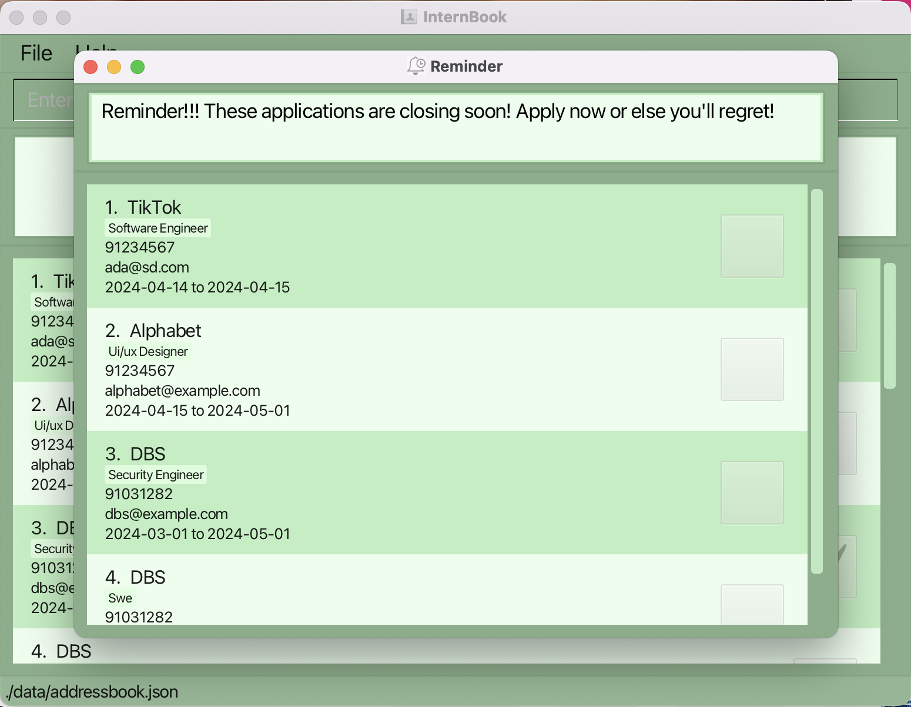
* If there are no applications outstanding, the reminder window below is shown.
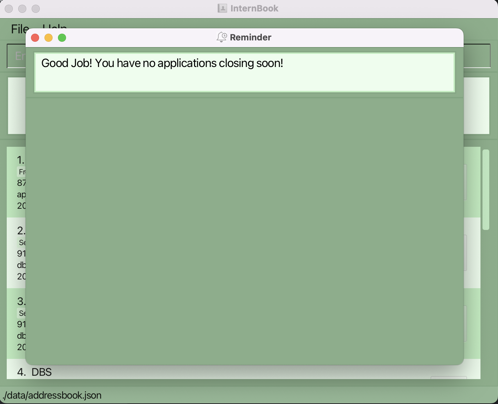

>:bulb:**TIP**:
> To switch off reminder, simply key `reminder -r off`.

### Clearing all entries : `clear`

Clears all entries from the intern book.

Format: `clear`

### Exiting the program : `exit`

Exits the program.

Format: `exit`

### Saving the data

InternBook data are saved in the hard disk automatically after any command that changes the data. There is no need to save manually.

### Editing the data file

InternBook data are saved automatically as a JSON file `[JAR file location]/data/internBook.json`. Advanced users are welcome to update data directly by editing that data file.

<box type="warning" seamless>

**Caution:**
If your changes to the data file makes its format invalid, InternBook will discard all data and start with an empty data file at the next run.  Hence, it is recommended to take a backup of the file before editing it. 
Furthermore, certain edits can cause the InternBook to behave in unexpected ways (e.g., if a value entered is outside the acceptable range). Therefore, edit the data file only if you are confident that you can update it correctly.
</box>

--------------------------------------------------------------------------------------------------------------------

## Future Enhancements
* Notes :notebook_with_decorative_cover:
  * We acknowledge the need for jotting down notes, such as the questions asked during interviews or specific requirements
  like seeking penultimate students. Therefore, we aim to introduce a feature enabling you to document notes for each
  company individually.
* Archiving Data Files :floppy_disk:
  * We grasp the importance of preserving information post-internship applications, especially notes taken during or after
  the process. However, as the main window could become cluttered with numerous applications that you have applied,
  making it overwhelming, we've opted to introduce an archiving feature. This allows you to store applications away,
  displaying them only when necessary.
* Adding Application with only Start or End dates :heavy_plus_sign:
  * While it's typically advised to monitor both start and end dates, we've taken your feedback into account. We've heard
  from some of you that you prioritise the application end date. Currently, we only display dates when both start and end
  dates are available. In the near future, we'll adjust this to show dates for the application whenever either one is
  provided.
* Alerting Users to Potential Duplicates :heavy_exclamation_mark:
  * In cases where a company's name, phone number, or email address matches existing entries in our system, we prompt the
  user to confirm whether they wish to create a new record or append to an existing one.

--------------------------------------------------------------------------------------------------------------------

## FAQ

**Q**: How do I transfer my data to another Computer?  
**A**: Install the app in the other computer and overwrite the empty data file it creates with the file that contains the data of your previous InternBook home folder.

**Q**: How do I check if I am on JDK 11?  
**A**: For MAC users, open up your **Terminal**, and for Windows users, open up your **Command Prompt**.
Type in `java -version` and you will see the java version.

**Q**: How do I navigate to my folder on my terminal?  
**A**: For **Windows** user:
1. Open Windows File Explorer.
2. Navigate to the parent folder of the target folder and double-click into it (the folder you want to open a command window into)

3. Click on the file explorer address bar of the folder you are in and copy the File Path (e.g. C:\Users\PC\Downloads\internBook)
and type "cmd" and press enter.

For **Mac** users:
1. Open Finder.
2. Navigate to the parent folder of the target folder but do not double-click into it (the folder you want to open a terminal window into)
3. Right-Click on the folder and hover over Services (At the bottom), Click New Terminal at Folder.

   * If there is no such option, you will have to go to your Settings > Keyboard > Keyboard Shortcuts... > Services > Files and Folders > Tick New Terminal At Folder
    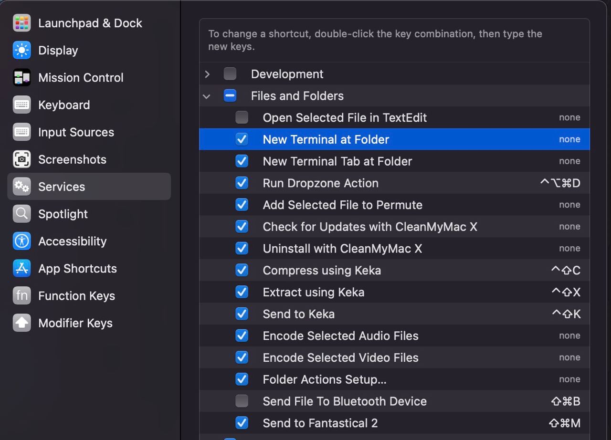

5. Now try again,
   * A Terminal at the folder location will pop up.

**Q**: Why are my dates missing in the GUI? 
**A**: Ensure that you have keyed in the start date and end date for the internship application. If only one date is present,
it will not show in the GUI. You can [edit](#editing-a-company-edit) them accordingly.

**Q**: What causes the occurrence of multiple records for companies sharing the same name, email, phone, and tag? 
**A**: We apologise for the confusion. Please refer to [known issues](#known-issues). Different application records may
be stored if there are distinctions in their name, phone number, email address, start date, end date, or tags. However,
if only the start date or end date is available, those dates won't be displayed, potentially leading to confusion.

**Q**: Can different companies be tagged to the same email address? 
**A**: Yes, it's possible. We permit multiple company names to share the same email address. For instance, consider
inputs like OCBC Tech or OCBC Finance. We offer users the flexibility to customise company names, including departmental
distinctions, even if they share an email address.

**Q**: Why is it possible to add applications with dates that have already passed? 
**A**: Users are permitted to add applications with past dates because we're in the process of developing new
[features](#future-enhancements). These features will enable users to take notes about specific companies, which they can
refer back to when considering future applications.

**Q**: When is a company classified as a duplicate? 
**A**: A company is identified as a duplicate when you attempt to add a record with identical name, phone number, email
address, tags, start date, and end date as an existing entry. If all these fields matches, the system flags it as a duplicate,
preventing the addition of such an application.

**Q**: Why do applications with no dates appear between sorted applications by start or end date?  
**A**: We apologise for the confusion caused. This occurs because some applications may have only a start date or an end
date entered, causing them not to display any dates. However, when sorting by start date, applications with only a start
date will also be considered in the sorting process.

--------------------------------------------------------------------------------------------------------------------

## Known issues

1. **When using multiple screens**, if you move the application to a secondary screen, and later switch to using only the primary screen, the GUI will open off-screen. The remedy is to delete the `preferences.json` file created by the application before running the application again.
2. **Only when both start and end dates are present, will the date be shown in the GUI**. If only one of the dates is present, the sorts will take them into account while sorting, leading to misleading errors such as the one below.

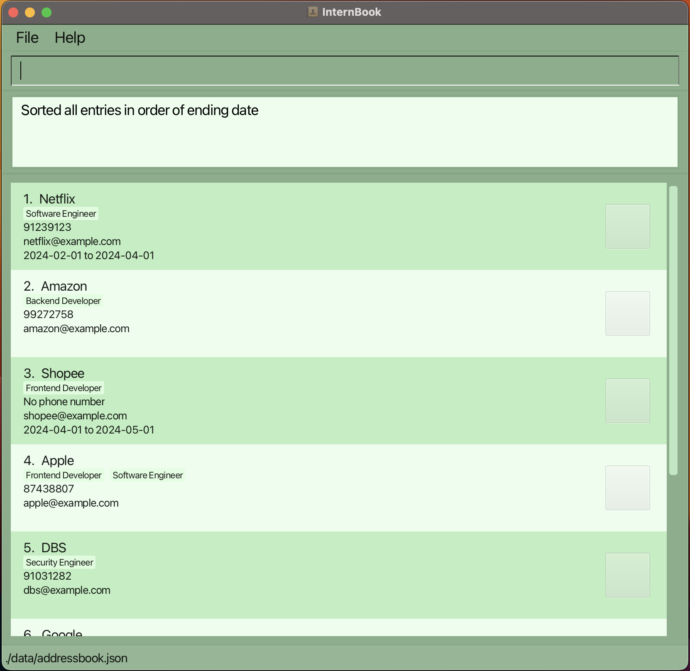

3. **Only when both start and end dates are present, will the date be shown in the GUI**, this allows users to seemingly add in duplicate companies when in fact the start/end dates are different.
4. **Duplicate tags**, are allowed to be added into the same company, however they will still only show unique tags.
5. **Error messages** for tags, due not account for the fact that tags cannot begin and end with "/"
6. The text displayed within the command box may be difficult to discern.
    

--------------------------------------------------------------------------------------------------------------------

## Command summary

| Action       | Format, Examples                                                                                                                                      |
|--------------|-------------------------------------------------------------------------------------------------------------------------------------------------------|
| **Help**     | `help`                                                                                                                                                |
| **List**     | `list`                                                                                                                                                |
| **Add**      | `add -n NAME -e EMAIL -t TAG…​ [-p PHONE_NUMBER] [-d1 START_DATE] [-d2 END_DATE]`   e.g., `add -n Meta -e meta@example.com  -t Software Developer` |
| **Edit**     | `edit INDEX [-n NAME] [-p PHONE_NUMBER] [-e EMAIL] [-d1 START_DATE] [-d2 END_DATE] [-t TAG…​]`  e.g.,`edit 2 -n DBS -p 91234567`                   |
| **Find**     | `find KEYWORD `  e.g., `find Google`, `find Software`                                                                                              |
| **Delete**   | `delete INDEX`  e.g., `delete 3`                                                                                                                   |
| **Mark**     | `mark INDEX`  e.g., `mark 1`                                                                                                                       |
| **Unmark**   | `unmark INDEX`  e.g, `unmark 3`                                                                                                                    |
| **Sort**     | `sort PREF`  e.g., `sort a`, `sort s`, `sort e`                                                                                                    |
| **Reminder** | `reminder -r NUMOFDAYS`   e.g., `reminder -r 7`, `reminder -r off`                                                                                 |
| **Clear**    | `clear`                                                                                                                                               |
| **Exit**     | `exit`                                                                                                                                                |

